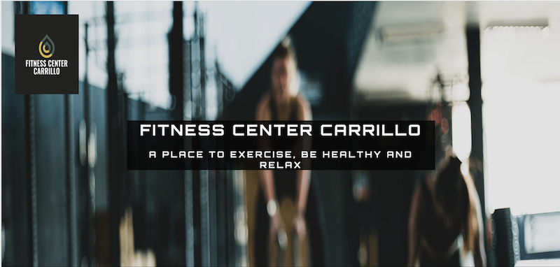
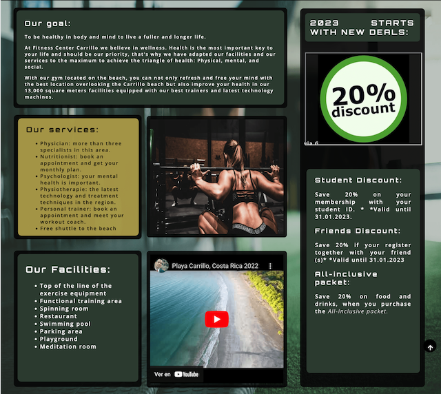
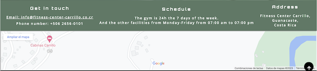
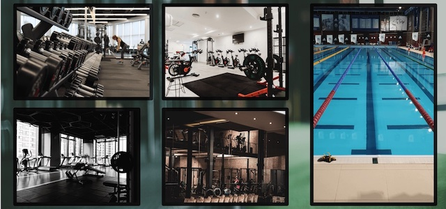
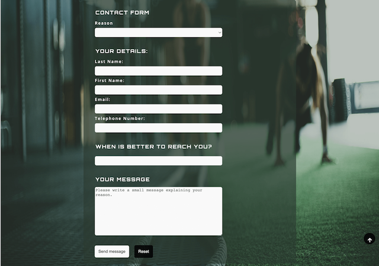

# Fitness Center Carrillo.

Language en-US

The author designed the website for the customers hoping that all queries about our facilities, and services in Carrillo, Costa Rica, could be answered. The site targets all customers who want to learn about our services and why Fitness Center Carrillo is the best in the region.
# Features
## 1. Existing features:

+   ### The logo and main landing page:

    - The logo was created on the website freelogodesign.org. 
    - Based on the psychology of colors, we used yellow, which represents optimism, clarity, and warmth; green brings peace, health, and growth, and the gray color was used as a background to contrast and relieve the sight. 

    - We also add the name of the logo in a more oversized letter to catch our user's eye and attention. 
    - We have a fixed unfocused (copyright protection) background image, which was acquired from the Unsplash site, about women doing exercise. The image works subconsciously; the user knows he is on a site about the gym, health, and fitness.

+   ### The navigation bar:
    - Offers the user the possibility to travel to the different areas of our website. 
    - It has an active function to let the user know the actual page is visited by underlying the word and a hover function by changing the opposite background color and letter color to allow the user to see when he hovers over an item.
    - It has a home, gallery, and contact tab with icons for accessibility reasons such as dyslexia or analphabetism. It is the same throughout all the website pages to give stability to the user.
    - It has space to give the opportunity in the future to add more tabs if needed.

+   ### The information section:
    - This section is the highlight of the home tab. It summarizes our goal, most essential services, and facilities, which stand out from our competition for the user to acknowledge.
    - It was created from left to right, being the left more important than the right.
    - It has an image of a female doing a squat to emphasize to the user that we are a center of exercise. 
    - It also has a video of Carrillo beach, not just to exercise but to walk, relax and meditate. The video's purpose is to inform the user that a beach is near the Fitness Center Carrillo.
    - In the right section, we have a discount area to attract not only wealthy customers but also the most humble customers. We believe that all persons be affordably entitled to health.           

+   ### The contact information and map section:
    - This section goes through all the web pages on the website to give routine to the customer and easy access to the user about our schedule, address, email, and telephone number; no need to move from the actual page.

+   ### The footer section.
    - Like other sections of the site, it goes through all our web pages for the same reasons as the others, to make a habit of our web pages.
    - It has our social media links, which open in a different tab, to help the user not to lose our site but also to stay connected with us and informed.

+   ### The gallery tab.
    - It is a small section but essential to show our users our most important facility, the gym section, as it gives an idea to the user of the quality of the equipment and the swimming pool.

+   ### The contact formula tab and section:
    - It allows the user to contact us without opening an email app. 

+   ### Go to the top button. 
    - Lovely user feature to avoid scrolling the way up with the hover function as in the navigation bar.

## 2. Features excluded: 
 - ### The blog section: 
    - This area will be enjoyable for the reader to know more about elemental topics such as health, nutrition, and others.
 - ### The member section:
    - To become a member without the need to come to us and travel. Alternatively, customers from other countries wanting to use our facilities in the meantime being in Costa Rica and save time.
# Testing:
   - Using the links provided by Code institute, the author's code was tested rigorously throughout creating a webpage using HTML5 and CSS language. 
   - The author used Mozilla, Chrome, and Safari to test the website on a laptop and a Mac desktop 5k and found a position problem with the laptop and the Mac, which needed to create another media query for users with a high-resolution display and a resolution pixel of more than 1300px. 
 - The background picture went through crop sizing for tablets(768x800px) and mobiles(568x800px). The Gallery pictures stayed at full resolution despite using the picture element with the source attribute failing to react in responsive design. Regardless of the image element with "srcset," "size," and "src" attributes did not contribute further help in responsive design. However, validation did not appear other issues or errors. Media query and TinyPNG were used to resolve the abovementioned problem to have good, no stretched or pixeled images.
 - At first, the author used google icons but failed to create a responsive design. For that reason, another font source like Fontawesome.com was used to solve the problem. The author used version 5 because version 6 was not working correctly.
  - All of the colors used in the site were tested with [webaim](https://webaim.org/resources/contrastchecker/).
## Validator testing
- Html
    + No errors were returned when passing through the official [W3C validator.]()
    + No errors were returned when passing through the official [W3C CSS validaotr.]()
# Deployment.

- After committing and pushing from Gitpod, the website was deployed using Github.
- Steps:
    - First, in the fitness center repository, navigate to the settings tab. 
    - Afterward, click on the Page tab on the left side of the site. 
    - Open a new section, "Build and deploy," choose the source, deploy from the branch, and then choose the main branch. 
    - After that, the site was refreshed, and appeared the link to visit the fitness center website. 
    - After a few minutes, the author received an email from GitHub that the deployment of the webpage was successful.
    - The link to the website is https://brianrosenkranz.github.io/fitness-center/.

# Credit
- All text content was personally created. 
- A part of the contact form was obtained from [Code]((https://formdump.codeinstitute.net)) Institute as the "value" for the "action" attribute for the form element.
- The use of Pinterest was necessary for obtaining ideas for web design.
[Pexels](https://www.pexels.com/@brian-mora-rosenkranz-394880008/?nc=) and [Unsplash]( https://unsplash.com/) supplied the pictures and images. All the pictures except the background pictures are clickable and open an extern tab, where the image was taken from.
- The icons came from [Fontawesome](https://fontawesome.com/).
- The video was brought from YouTube.
- The following internet pages obtained the flex element for CSS and the grid. (https://css-tricks.com/snippets/css/a-guide-to-flexbox/ and https://www.w3schools.com/tags/att_a_rel.asp
-Media query was taken from Code institute and a GitHub blog.
- The logo was fetched from https://www.freelogodesign.org/
- The psychology of color is acquired on the website. https://hs-marketing-contentful.imgix.net/https%3A%2F%2Fimages.ctfassets.net%2Fp15sglj92v6o%2F3zeRC0ATjrNo7vCfFoXs6%2F47858c9fee60a7a3a89722355e1ccdd7%2F5-17-emotion.png?ixlib=gatsbySourceUrl-2.0.2&auto=format%2Ccompress&w=690&h=605&s=9ee2ab0bfe321259db8388343dc68495
- I use the ReadMe template of coding institue
